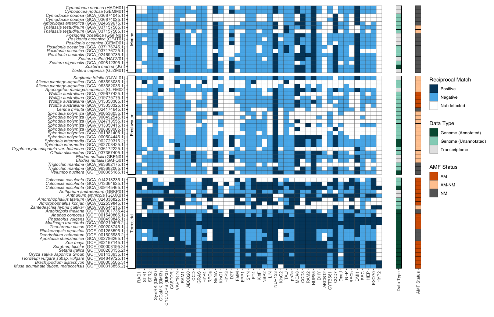
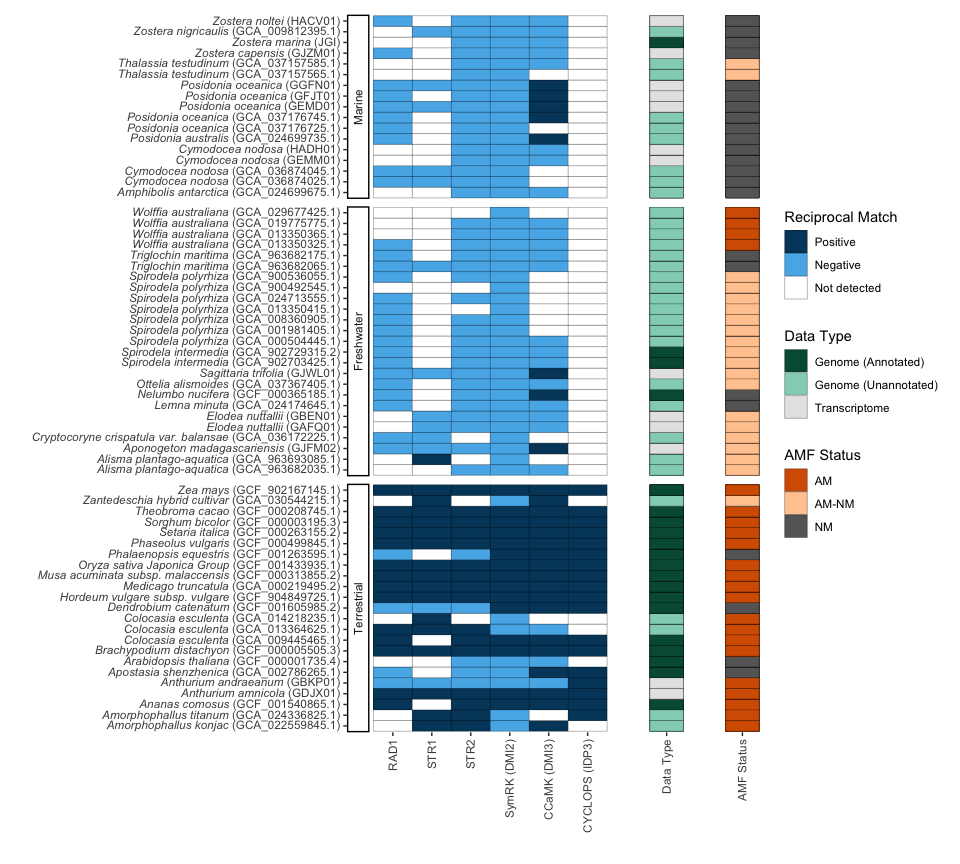

Exploring conservation of AMF genes in aquatic Alismatales
================
Cassie Ettinger

``` r
# Load libraries
library(tidyverse)
```

    ## Warning: package 'ggplot2' was built under R version 4.3.2

    ## Warning: package 'tidyr' was built under R version 4.3.2

``` r
library(vroom)
library(patchwork)
library(ggtext)
```

## Pre-process reciprical blast output

``` r
# Load in metadata
metadata <- vroom("../data/sequences_used_info.txt")
symbiosis <- vroom("../data/symbiosis_genes.txt")

# Load in blast results
blast_files <- dir("../data/match_results/", pattern = "*.tsv")  # get file names

# Map file contents to a single dataframe
blast_data <- data_frame(File = blast_files) %>%
    mutate(file_contents = map(File, ~read_tsv(file.path("../data/match_results/",
        .))))
```

    ## Warning: `data_frame()` was deprecated in tibble 1.1.0.
    ## ℹ Please use `tibble()` instead.
    ## This warning is displayed once every 8 hours.
    ## Call `lifecycle::last_lifecycle_warnings()` to see where this warning was
    ## generated.

``` r
blast_data_un <- unnest(blast_data, cols = c(file_contents))  #turns list of files into one file

# Update names so can combine with metadata
blast_matches <- blast_data_un %>%
    mutate_at("File", str_replace, ".results.tsv", "")

# Re-order file and clean up
blast_res_clean <- blast_matches %>%
    pivot_wider(id_cols = File, names_from = Gene, values_from = RecipricalMatch) %>%
    left_join(metadata) %>%
    relocate(Name) %>%
    relocate(Type, .after = Name) %>%
    relocate(Family, .after = Name) %>%
    relocate(Order, .after = Name) %>%
    relocate(Species, .after = Family) %>%
    relocate(Habitat, .after = Species) %>%
    relocate(File, .after = last_col())

# Save processed data write.csv(blast_res_clean,
# '../results/Reciprocal Blast Results.txt', quote = FALSE,
# row.names=FALSE)

# Update some names to use with markdown
```

## Figure 1

``` r
# Load in results with markdown names
blast_res <- vroom("../results/Reciprocal Blast Results MD.txt")

# How many samples x habitat 
blast_res %>% 
  group_by(Habitat) %>%
  tally()
```

    ## # A tibble: 3 × 2
    ##   Habitat         n
    ##   <chr>       <int>
    ## 1 Freshwater     25
    ## 2 Marine         17
    ## 3 Terrestrial    23

``` r
# How many samples x predicted AMF status 
blast_res %>% 
  group_by(`AMF Status (FungalRoot database)`) %>%
  tally()
```

    ## # A tibble: 3 × 2
    ##   `AMF Status (FungalRoot database)`     n
    ##   <chr>                              <int>
    ## 1 AM                                    22
    ## 2 NM                                    23
    ## 3 NM-AM                                 20

``` r
# How many samples x data type 
blast_res %>% 
  group_by(Type) %>%
  tally()
```

    ## # A tibble: 3 × 2
    ##   Type                     n
    ##   <chr>                <int>
    ## 1 Genome (Annotated)      20
    ## 2 Genome (Unannotated)    32
    ## 3 Transcriptome           13

``` r
# Pivot columns representing the genes on cols 8 through 52 in a new column "Gene"
# this is to make a longer format for the data
# gene values will be on a new column "Reciprocal Match"

# Plot blast results per gene
a <- pivot_longer(blast_res,cols = 8:52,names_to = 'Gene', values_to = 'Reciprocal Match') %>%
  mutate(Habitat = factor(Habitat, levels=c("Marine", "Freshwater", "Terrestrial"))) %>%  
  mutate(Name = factor(Name), 
         Name = fct_reorder(Name, `AMF Status (FungalRoot database)`, .desc = TRUE),
         Name = fct_reorder(Name, Family, .desc = TRUE)) %>% #reorder names by taxonomic family so close relatives together
  mutate(`Reciprocal Match` = ifelse(is.na(`Reciprocal Match`), "ND", as.character(`Reciprocal Match`))) %>% #replace NA's with a value ND 
  mutate(`Reciprocal Match` = factor(`Reciprocal Match`, 
                                     levels=c("TRUE", "FALSE", "ND"),
                                     labels=c("TRUE" = "Positive", "FALSE" = "Negative", 'ND' = "Not detected"))) %>% #change order and relabel for plot
  ggplot(aes(x= Gene, y= Name, fill = `Reciprocal Match`)) +              
  geom_tile(aes(x=fct_inorder(Gene), y=Name), color = "black") +       # reorders 
  scale_x_discrete(guide = guide_axis(angle = 90)) +        # removed overlapping axis labels
  scale_fill_manual(values = c("#00466B","#56B4E9", "white")) + 
  theme_classic() +
  theme(axis.text.x = element_text(angle = 90, vjust = 0.5, hjust=1)) +
  facet_grid(Habitat ~ ., scales = "free", space = "free", switch = "y") + # splits out habitats
  xlab("") +
  ylab("")  +
  theme(axis.line.x = element_blank(),
        axis.text.y = element_markdown(),
        axis.line.y = element_blank(),
  )

# Plot habitat
b <- pivot_longer(blast_res,cols = 8:52,names_to = 'Gene', values_to = 'Reciprocal Match') %>%
  mutate(Habitat = factor(Habitat, levels=c("Marine", "Freshwater", "Terrestrial"))) %>% # reorder Habitat 
  mutate(DataType = "Data Type") %>%
  mutate(Name = factor(Name), 
         Name = fct_reorder(Name, `AMF Status (FungalRoot database)`, .desc = TRUE),
         Name = fct_reorder(Name, Family, .desc = TRUE)) %>% #reorder names by taxonomic family so close relatives together
  ggplot(aes(x= DataType, y= Name, fill = Type)) +              
  geom_tile(color = "black") +                   # tiles with a black border  
  theme_classic() +
  scale_x_discrete(guide = guide_axis(angle = 90)) +        # removed overlapping axis labels
  scale_fill_manual(values = c("#005A41","#93D2C1", "grey90")) + 
  facet_grid(Habitat ~ ., scales = "free", space = "free", switch = "y") + # splits out habitats
  xlab("") +
  ylab("")  + 
  theme(axis.text.y = element_blank(),
    axis.ticks.y = element_blank(),
    strip.background = element_blank(),
    strip.text.y = element_blank(),
    axis.line.y = element_blank(),
    axis.line.x = element_blank()) +
  guides(fill=guide_legend(title="Data Type"))

# Plot data type
c <- pivot_longer(blast_res,cols = 8:52,names_to = 'Gene', values_to = 'Reciprocal Match') %>%
  mutate(Habitat = factor(Habitat, levels=c("Marine", "Freshwater", "Terrestrial"))) %>% # reorder Habitat 
  mutate(Name = factor(Name), 
         Name = fct_reorder(Name, `AMF Status (FungalRoot database)`, .desc = TRUE),
         Name = fct_reorder(Name, Family, .desc = TRUE)) %>% #reorder names by taxonomic family so close relatives together
  mutate(`AMF Status (FungalRoot database)` = factor(`AMF Status (FungalRoot database)`, levels=c('AM', 'NM-AM', 'NM'), labels = c('AM' ,'AM-NM', 'NM'))) %>%
  mutate(AMF = "AMF Status") %>%
  ggplot(aes(x= AMF, y= Name, fill = `AMF Status (FungalRoot database)`)) +              
  geom_tile(color = "black") +                   # tiles with a black border  
  theme_classic() +
  scale_x_discrete(guide = guide_axis(angle = 90)) +        # removed overlapping axis labels
  scale_fill_manual(values = c( "#D55E00","#FFCA9F", "grey40" )) + 
  facet_grid(Habitat ~ ., scales = "free", space = "free", switch = "y") + # splits out habitats
  xlab("") +
  ylab("")  + 
  theme(axis.text.y = element_blank(),
        axis.ticks.y = element_blank(),
        strip.background = element_blank(),
        strip.text.y = element_blank(),
        axis.line.y = element_blank(),
        axis.line.x = element_blank()
  ) +
  guides(fill=guide_legend(title="AMF Status"))


# Combine
a + b + c + plot_layout(guides='collect', widths = c(38, 1,1))
```

<!-- -->

``` r
ggsave(filename = '../plots/figure1.pdf', plot = last_plot(), device = 'pdf', width = 14, height = 9, dpi = 300)
ggsave(filename = '../plots/figure1.png', plot = last_plot(), device = 'png', width = 14, height = 9, dpi = 300)
```

## Figure S1

``` r
a2 <- pivot_longer(blast_res,cols = 8:52,names_to = 'Gene', values_to = 'Reciprocal Match') %>%
  filter(Gene %in% c('RAD1', 'STR1', 'STR2', 'SymRK (DMI2)', 'CCaMK (DMI3)', 'CYCLOPS (IDP3)')) %>%
  mutate(Habitat = factor(Habitat, levels=c("Marine", "Freshwater", "Terrestrial"))) %>% # reorder Habitat 
  mutate(Name = factor(Name), 
         #Name = fct_reorder(Name, `AMF Status (FungalRoot database)`, .desc = TRUE),
         Name = fct_reorder(Name, Family, .desc = TRUE)) %>% #reorder names by taxonomic family so close relatives together
  mutate(`Reciprocal Match` = ifelse(is.na(`Reciprocal Match`), "ND", as.character(`Reciprocal Match`))) %>% #replace NA's with a value ND 
  mutate(`Reciprocal Match` = factor(`Reciprocal Match`, 
                                     levels=c("TRUE", "FALSE", "ND"), 
                                     labels=c("TRUE" = "Positive", "FALSE" = "Negative", 'ND' = "Not detected"))) %>% #change order and relabel for plot
  ggplot(aes(x= Gene, y= Name, fill = `Reciprocal Match`)) +              
  geom_tile(aes(x=fct_inorder(Gene), y=Name)) +       # reorders the gene order
  geom_tile(stat = "identity") +
  geom_tile(color = "black") +                   # tiles with a black border  
  scale_x_discrete(guide = guide_axis(angle = 90)) +        # removed overlapping axis labels
  scale_fill_manual(values = c("#00466B","#56B4E9", "white")) + 
  theme_classic() +
  theme(axis.text.x = element_text(angle = 90, vjust = 0.5, hjust=1)) +
  facet_grid(Habitat ~ ., scales = "free", space = "free", switch = "y") + # splits out habitats
  xlab("") +
  ylab("")  + 
  theme(axis.line.x = element_blank(),
        axis.text.y = element_markdown(),
        axis.line.y = element_blank(),)
```

    ## Warning: There were 65 warnings in `mutate()`.
    ## The first warning was:
    ## ℹ In argument: `Name = fct_reorder(Name, Family, .desc = TRUE)`.
    ## Caused by warning in `mean.default()`:
    ## ! argument is not numeric or logical: returning NA
    ## ℹ Run `dplyr::last_dplyr_warnings()` to see the 64 remaining warnings.

``` r
b2 <- pivot_longer(blast_res,cols = 8:52,names_to = 'Gene', values_to = 'Reciprocal Match') %>%
  filter(Gene %in% c('RAD1', 'STR1', 'STR2', 'SymRK (DMI2)', 'CCaMK (DMI3)', 'CYCLOPS (IDP3)')) %>%
  mutate(Habitat = factor(Habitat, levels=c("Marine", "Freshwater", "Terrestrial"))) %>% # reorder Habitat 
  mutate(DataType = "Data Type") %>%
  mutate(Name = factor(Name), 
         #Name = fct_reorder(Name, `AMF Status (FungalRoot database)`, .desc = TRUE),
         Name = fct_reorder(Name, Family, .desc = TRUE)) %>% #reorder names by taxonomic family so close relatives together
  ggplot(aes(x= DataType, y= Name, fill = Type)) +              
  geom_tile(color = "black") +                   # tiles with a black border  
  theme_classic() +
  scale_x_discrete(guide = guide_axis(angle = 90)) +        # removed overlapping axis labels
  scale_fill_manual(values = c("#005A41","#93D2C1", "grey90")) + 
  facet_grid(Habitat ~ ., scales = "free", space = "free", switch = "y") + # splits out habitats
  xlab("") +
  ylab("")  + 
  theme(axis.text.y = element_blank(),
        axis.ticks.y = element_blank(),
        strip.background = element_blank(),
        strip.text.y = element_blank(),
        axis.line.y = element_blank(),
        axis.line.x = element_blank()
  ) +
  guides(fill=guide_legend(title="Data Type"))
```

    ## Warning: There were 65 warnings in `mutate()`.
    ## The first warning was:
    ## ℹ In argument: `Name = fct_reorder(Name, Family, .desc = TRUE)`.
    ## Caused by warning in `mean.default()`:
    ## ! argument is not numeric or logical: returning NA
    ## ℹ Run `dplyr::last_dplyr_warnings()` to see the 64 remaining warnings.

``` r
c2 <- pivot_longer(blast_res,cols = 8:52,names_to = 'Gene', values_to = 'Reciprocal Match') %>%
  filter(Gene %in% c('RAD1', 'STR1', 'STR2', 'SymRK (DMI2)', 'CCaMK (DMI3)', 'CYCLOPS (IDP3)')) %>%
  mutate(Habitat = factor(Habitat, levels=c("Marine", "Freshwater", "Terrestrial"))) %>% # reorder Habitat 
  mutate(AMF = "AMF Status") %>%
  mutate(Name = factor(Name), 
         #Name = fct_reorder(Name, `AMF Status (FungalRoot database)`, .desc = TRUE),
         Name = fct_reorder(Name, Family, .desc = TRUE)) %>% #reorder names by taxonomic family so close relatives together
  mutate(`AMF Status (FungalRoot database)` = factor(`AMF Status (FungalRoot database)`, levels=c('AM', 'NM-AM', 'NM'), labels = c('AM' ,'AM-NM', 'NM'))) %>%
  ggplot(aes(x= AMF, y= Name, fill = `AMF Status (FungalRoot database)`)) +              
  geom_tile(color = "black") +                   # tiles with a black border  
  theme_classic() +
  scale_x_discrete(guide = guide_axis(angle = 90)) +        # removed overlapping axis labels
  scale_fill_manual(values = c( "#D55E00","#FFCA9F", "grey40" )) + 
  facet_grid(Habitat ~ ., scales = "free", space = "free", switch = "y") + # splits out habitats
  xlab("") +
  ylab("")  + 
  theme(axis.text.y = element_blank(),
        axis.ticks.y = element_blank(),
        strip.background = element_blank(),
        strip.text.y = element_blank(),
        axis.line.y = element_blank(),
        axis.line.x = element_blank()
  ) +
  guides(fill=guide_legend(title="AMF Status"))
```

    ## Warning: There were 65 warnings in `mutate()`.
    ## The first warning was:
    ## ℹ In argument: `Name = fct_reorder(Name, Family, .desc = TRUE)`.
    ## Caused by warning in `mean.default()`:
    ## ! argument is not numeric or logical: returning NA
    ## ℹ Run `dplyr::last_dplyr_warnings()` to see the 64 remaining warnings.

``` r
a2 + b2 + c2 + plot_layout(guides='collect', widths = c(6, 1,1))
```

<!-- -->

``` r
ggsave(filename = '../plots/figureS1.pdf', plot = last_plot(), device = 'pdf', width = 10, height = 9, dpi = 300)
ggsave(filename = '../plots/figureS1.png', plot = last_plot(), device = 'png', width = 10, height = 9, dpi = 300)
```
